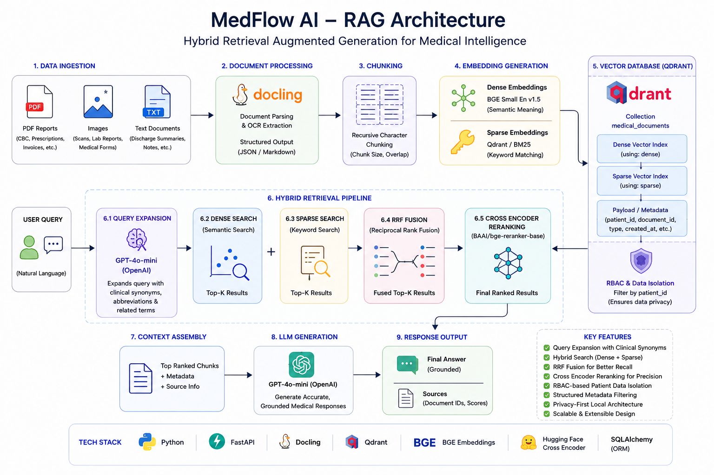
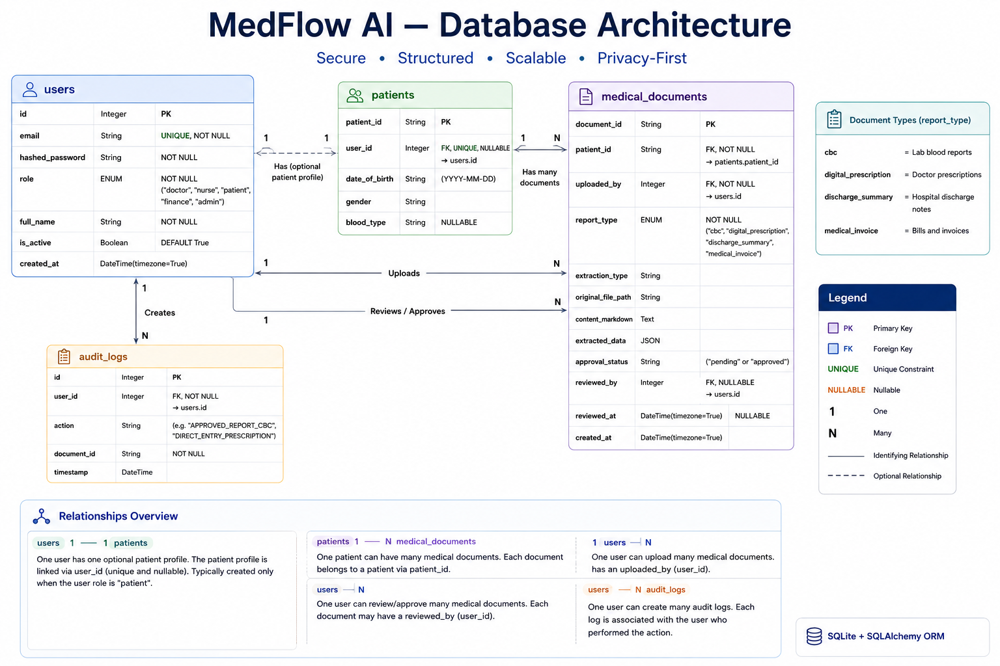

# MedFlow AI 🏥

> **Status: Actively in Development** — Backend core is functional. Frontend, golden dataset evaluation, and admin observability layer are in progress.

---

## Problem Statement

Healthcare systems generate large amounts of unstructured and semi-structured data — prescriptions, blood reports, discharge summaries, scanned medical documents, and more. Managing, understanding, and securely accessing this information is difficult for healthcare staff and patients alike.

Most existing platforms lack:
- Intelligent medical document understanding
- Secure role-based AI access
- Human-in-the-loop validation before data enters the knowledge base
- Trustworthy retrieval systems grounded in real patient records
- Production-oriented AI system design

**MedFlow AI** solves these challenges by building a secure clinical intelligence backend powered by Retrieval-Augmented Generation (RAG), Role-Based Access Control (RBAC), and Human-in-the-Loop (HITL) document validation workflows.

---

---

## Architecture Overview

### Backend & Authentication Flow


---

### RAG Pipeline Architecture



---

### Database Architecture



---

## What Has Been Implemented

### 1. Authentication & Role-Based Access Control

Full JWT-based authentication system built with FastAPI and SQLAlchemy.

- Five user roles supported: `doctor`, `nurse`, `patient`, `finance`, `admin`
- Passwords hashed with `bcrypt` via `passlib`
- JWT tokens issued on login with role embedded in payload (`/auth/token`)
- `get_current_user` dependency extracts and validates role on every protected route
- Role enforcement on every API endpoint — unauthorized roles receive `401`/`403` before any logic runs
- Finance role restricted to medical invoice uploads only
- Clinical staff (doctor/nurse) blocked from uploading financial documents

**Relevant files:** `auth.py`, `models.py`

---

### 2. Medical Document Ingestion Pipeline

A multi-extractor document processing pipeline that handles four distinct medical document types.

**Supported document types:**
| Type | Extractor | Output |
|---|---|---|
| CBC Blood Report | `CBCExtractor` | Structured `UniversalBloodReport` schema via LLM |
| Digital Prescription | `DigitalPrescriptionExtractor` | Markdown text via Docling OCR |
| Discharge Summary | `DischargeSummaryExtractor` | Markdown text via Docling OCR |
| Medical Invoice | `MedicalInvoiceExtractor` | Structured `UniversalInvoiceSchema` schema via LLM |

**How it works:**
1. File is saved to `storage/uploads/` with a unique `document_id`
2. Docling `DocumentConverter` converts the file (PDF/image) to markdown
3. For CBC and Invoice types, markdown is passed to GPT-4o-mini with structured output enforced via Pydantic schemas
4. Extracted data is saved to SQLite with `approval_status = "pending"`
5. Document is quarantined until a nurse reviews and approves it

**Relevant files:** `extractor.py`, `cbc_extractor.py`, `digital_prescription_extractor.py`, `discharge_summary_extractor.py`, `medical_invoice_extractor.py`, `schemas.py`, `prompts.py`

---

### 3. Human-in-the-Loop (HITL) Nurse Validation Workflow

Before any extracted medical data enters the vector knowledge base, it goes through nurse review.

**Flow:**
1. `POST /upload` → document extracted and saved with status `pending`
2. `GET /reports/pending` → nurse fetches all unreviewed documents with extracted data
3. `POST /reports/approve` → nurse submits corrected/confirmed structured data
4. On approval:
   - `approval_status` updated to `"approved"` in SQLite
   - `reviewed_by` and `reviewed_at` timestamps recorded
   - Audit log entry created: `APPROVED_REPORT_{TYPE}`
   - Document markdown is **asynchronously** ingested into Qdrant vector store via `BackgroundTasks`

This ensures only nurse-validated data ever enters the RAG knowledge base.

**Relevant files:** `medflow.py` (`/upload`, `/reports/pending`, `/reports/approve`)

---

### 4. Doctor CPOE Fast-Track (Direct Prescription Entry)

Doctors can bypass the extraction + nurse quarantine pipeline entirely for digital prescriptions they write themselves.

- `POST /prescriptions/direct` accepts structured medication payload
- Doctor ID in payload is cross-validated against the authenticated JWT token (prevents spoofing)
- Prescription is formatted into markdown and saved directly as `approved`
- Logged as `DIRECT_ENTRY_PRESCRIPTION` in audit log
- Immediately ingested into vector store via background task

**Prescription schema enforces:** medicine name, dosage, timing (`morning/afternoon/evening/night`), food instruction (`before/after/with/independent`), frequency (`daily/weekly/as_needed`)

**Relevant files:** `medflow.py` (`/prescriptions/direct`), `schemas.py`

---

### 5. Hybrid RAG Retrieval Pipeline

The core intelligence layer powering the patient chat system.

**Pipeline steps:**

```
User Query
    │
    ▼
Query Expansion (GPT-4o-mini)
  → Lay terms → Clinical synonyms + biomarkers
    │
    ▼
Dual Embedding Generation (local, no API cost)
  ├─ Dense:  BAAI/bge-small-en-v1.5  (semantic meaning)
  └─ Sparse: Qdrant/BM25             (exact keyword match)
    │
    ▼
Qdrant Hybrid Search with Security Filter
  ├─ Prefetch Dense  (top-20, patient_id filter)
  ├─ Prefetch Sparse (top-20, patient_id filter)
  └─ RRF Fusion      (Reciprocal Rank Fusion merges both lists)
    │
    ▼
Cross-Encoder Reranking (BAAI/bge-reranker-base)
  → Re-scores all candidates against original query
    │
    ▼
Top-K Documents → GPT-4o-mini → Grounded Answer + Sources
```

**Key design decisions:**
- Patient-level data isolation enforced via Qdrant `FieldCondition` payload filter — one patient can never retrieve another's records
- All embedding models run locally via `fastembed` (zero cost, no external API)
- Query expansion runs on a separate fast call before retrieval to enrich BM25 keyword matching
- Cross-encoder reranker runs after fusion for precision-focused final ranking

**Relevant files:** `retriever.py`, `embedder.py`, `optimizer.py`, `vectorstore.py`

---

### 6. Vector Store — Qdrant Hybrid Collection

Qdrant is configured as a local persistent store with a hybrid collection supporting both vector types.

- Collection: `medical_documents`
- Dense vector: `size=384`, cosine distance (matches `bge-small-en-v1.5` output)
- Sparse vector: IDF-modified BM25 index
- Payload indexes on `patient_id` and `role` for fast pre-filtering
- Documents chunked with `RecursiveCharacterTextSplitter` (`chunk_size=500`, `overlap=50`) before ingestion
- Each chunk stored with full metadata: `document_id`, `patient_id`, `report_type`, `chunk_index`

**Relevant files:** `vectorstore.py`

---

### 7. Patient Chat Endpoint

`POST /chat` — a conversational RAG endpoint for authenticated patients only.

- Verifies user is a `patient` and resolves their `patient_id` from the `Patient` profile table
- Runs full hybrid RAG retrieval scoped to that patient's records
- Builds context from top-K retrieved chunks with `[SOURCE N]` labels
- Supports multi-turn conversation via `history` field in request payload
- LLM instructed to answer only from provided context and never hallucinate diagnoses
- Returns: `final_answer`, `sources` (with `document_id`, `report_type`, `score`)

**Relevant files:** `medflow.py` (`/chat`), `schemas.py`

---

### 8. Role-Specific Data Access Endpoints

| Endpoint | Role | Purpose |
|---|---|---|
| `GET /patient/history` | `patient` | Fetch all approved documents for the logged-in patient |
| `GET /finance/invoices` | `finance` | Fetch all approved medical invoices with structured billing data |
| `GET /admin/logs` | `admin` | Fetch paginated audit logs joined with user emails |

---

### 9. Database Models & Audit Logging

Four SQLAlchemy ORM models:

- **`User`** — login credentials, role, `is_active` flag
- **`Patient`** — demographics table (DOB, gender, blood type, MRN), linked to `User`
- **`MedicalDocument`** — stores extracted data (JSON), markdown content, approval status, reviewer info, timestamps
- **`AuditLog`** — append-only compliance log of every major action (`UPLOADED_CBC`, `APPROVED_REPORT_CBC`, `DIRECT_ENTRY_PRESCRIPTION`, etc.)

**Relevant files:** `models.py`, `database.py`

---

## 🚧 In Progress

### Frontend (React)
Building a role-aware web interface:
- Patient portal: upload reports, view history, chat with medical AI
- Nurse dashboard: review pending extractions, edit and approve
- Doctor panel: write direct prescriptions, view patient history
- Finance view: browse approved invoices
- Admin panel: view audit logs

### Golden Dataset Pipeline
Building an evaluation dataset for RAG and extraction quality measurement:
- Curating real-world CBC, prescription, invoice, and discharge summary samples
- Annotating ground-truth structured outputs for extraction accuracy benchmarking
- Designing retrieval eval queries with expected source documents for RAG scoring (precision@k, recall@k, MRR)
- Will be used to run automated regression tests before any model or prompt changes

### Admin Observability Layer
- Hallucination detection via self-consistency scoring
- Retrieval confidence thresholds and fallback flags
- Per-role query analytics
- System health dashboard

---

## Tech Stack

| Layer | Technology |
|---|---|
| Backend Framework | FastAPI |
| LLM | GPT-4o-mini (OpenAI) |
| Document Parsing | Docling |
| Embedding (Dense) | BAAI/bge-small-en-v1.5 via fastembed |
| Embedding (Sparse) | Qdrant/BM25 via fastembed |
| Reranker | BAAI/bge-reranker-base via fastembed |
| Vector Store | Qdrant (local persistent) |
| Relational DB | SQLite via SQLAlchemy |
| Auth | JWT (python-jose) + bcrypt |
| Orchestration | LangChain (LLM calls), BackgroundTasks (async ingestion) |
| Data Validation | Pydantic v2 |

---

## User Roles

### Patient
- Upload prescriptions and medical reports
- Ask questions about their reports via conversational AI
- View simplified explanations of medical terms
- Access only their own approved document history

### Doctor
- Write and submit digital prescriptions directly (CPOE fast-track)
- Upload clinical reports for nurse review
- Access patient history endpoints

### Nurse
- Fetch pending AI-extracted documents
- Review, correct, and approve extracted structured data (HITL layer)
- Trigger vector ingestion on approval

### Finance
- Upload and access approved medical invoices only
- View structured billing data (line items, CPT codes, totals)

### Administrator
- Read full audit log with user emails and action timestamps
- Monitor all system activity