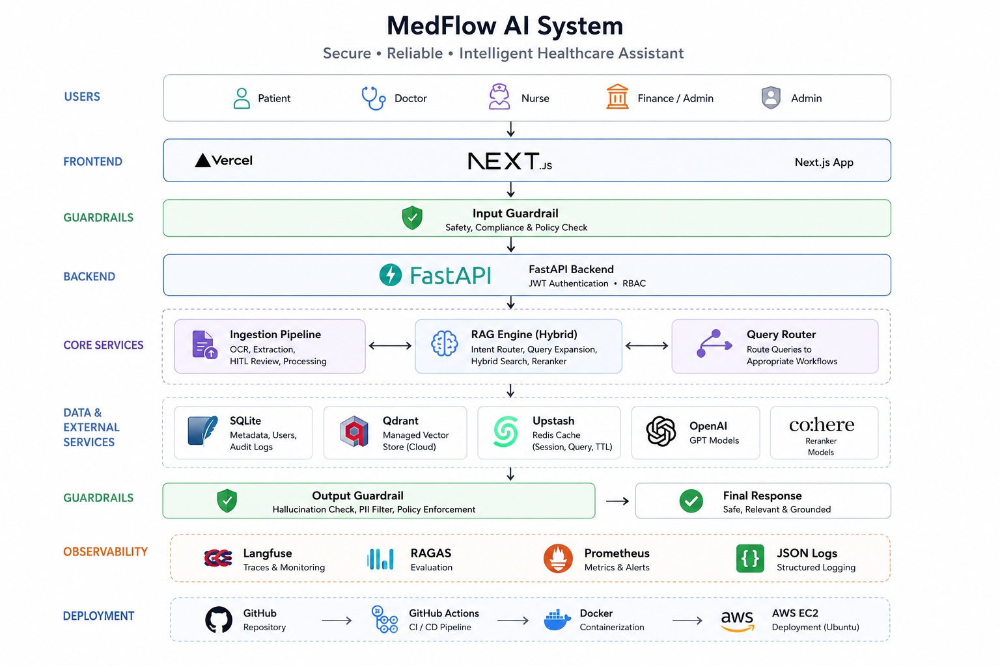
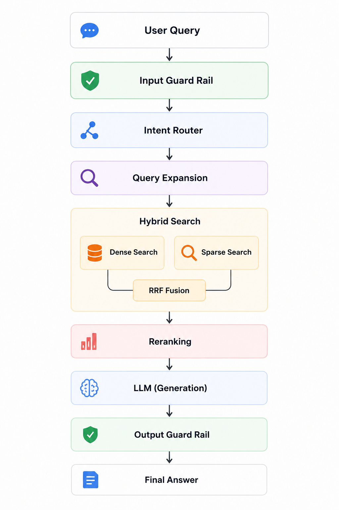
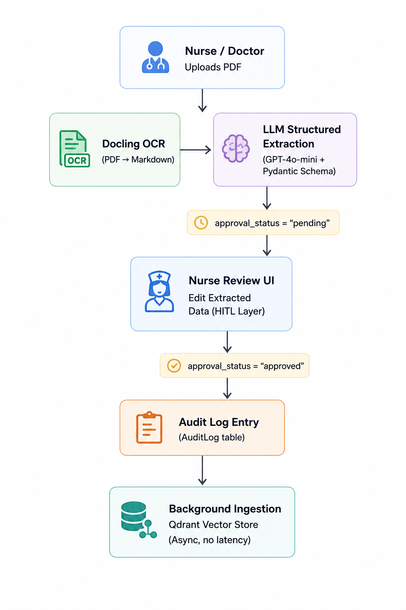
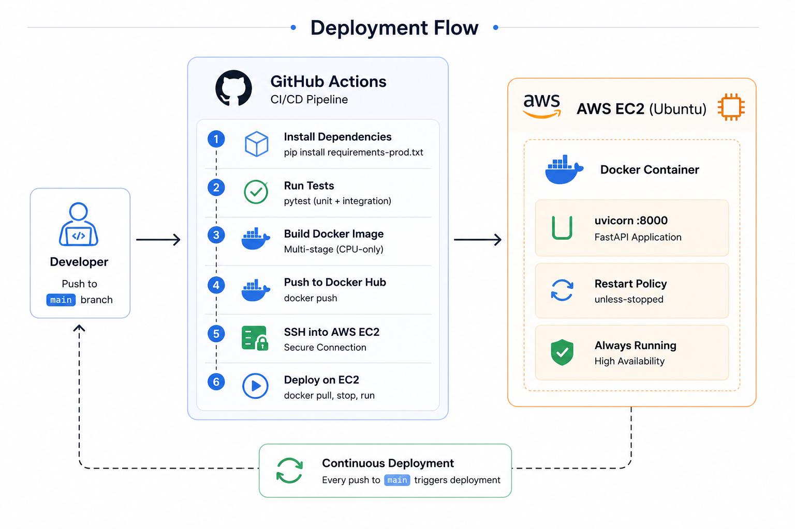

# MedFlow AI 🏥

> **A production-grade Clinical Intelligence Backend** — Secure, multi-role medical document intelligence platform powered by Hybrid RAG, Human-in-the-Loop validation, and a full MLOps observability stack.

[](https://python.org)
[](https://fastapi.tiangolo.com)
[](https://qdrant.tech)
[](https://docker.com)
[](https://aws.amazon.com/ec2)
[](https://github.com/features/actions)
[](https://docs.ragas.io)
[](https://langfuse.com)


## What Is MedFlow AI?

Healthcare systems drown in unstructured data — blood reports, prescriptions, discharge summaries, invoices — scattered across formats and inaccessible to the people who need them. Most existing platforms offer no intelligent understanding, no secure role-based access, and no trust layer before AI-generated data enters critical workflows.

**MedFlow AI** is a secure clinical intelligence backend that solves this. It ingests raw medical documents (PDFs, scans), extracts structured data using LLMs, routes them through a Human-in-the-Loop nurse validation workflow, and then indexes them into a **Hybrid RAG pipeline** — enabling doctors and patients to query their medical records through a conversational AI interface that is grounded, audited, and role-isolated.

Every design decision prioritizes three things: **security**, **trustworthiness**, and **production-readiness**.

## Highlights

- Hybrid RAG (Dense + BM25 + RRF + Cohere Reranker)
- Human-in-the-Loop document validation
- Input and Output Guardrails
- Upstash Redis caching
- Qdrant Cloud vector database
- Langfuse observability + Prometheus metrics
- RAGAS evaluation framework
- Role-based access control (RBAC)
- Docker + GitHub Actions + AWS EC2 deployment
---

## Architecture Diagrams

### Diagram 1 — System Architecture (High Level)

<p align="center">
  
</p>

### Diagram 2 — RAG Pipeline (The Core)

<p align="center">
  
</p>

### Diagram 3 — HITL Document Workflow

<p align="center">
  
</p>


### Diagram 4 — Deployment Pipeline

<p align="center">
  
</p>
---

## User Roles & Access Model

MedFlow AI implements a **five-role RBAC system**. Every API endpoint enforces role checks before any business logic executes.

| Role | What They Can Do |
|---|---|
| **Patient** | Upload own reports, view approved history, chat with AI about their records |
| **Doctor** | View assigned patients only, write direct prescriptions (CPOE), AI chat over patient records |
| **Nurse** | Upload documents for any patient, review & correct AI-extracted data, approve into knowledge base |
| **Finance** | Upload medical invoices only, access billing data, chat with compliance AI |
| **Admin** | View all audit logs, manage users, full system oversight |
| **Registration** | Register new patients, assign to doctors, generate OP tickets |

> Security principle: a doctor can only query AI for patients explicitly assigned to them. A patient can only see their own records. Cross-patient data leakage is impossible by design — enforced at both the API layer (JWT + DB query filter) and the vector store layer (Qdrant `FieldCondition` payload filter).

---

## Core Features

### 1. Multi-Extractor Document Ingestion Pipeline

Four dedicated extractors handle distinct medical document types:

| Document Type | Extractor | Output |
|---|---|---|
| CBC Blood Report | `CBCExtractor` | Structured `UniversalBloodReport` via GPT-4o-mini + Pydantic |
| Digital Prescription | `DigitalPrescriptionExtractor` | Markdown via Docling OCR |
| Discharge Summary | `DischargeSummaryExtractor` | Markdown via Docling OCR |
| Medical Invoice | `MedicalInvoiceExtractor` | Structured `UniversalInvoiceSchema` via LLM |

All documents land in a **quarantine state** (`approval_status = "pending"`) and cannot be retrieved or chatted over until a nurse explicitly approves them.

---

### 2. Human-in-the-Loop (HITL) Nurse Validation

This is the trust layer that separates MedFlow AI from a naive "upload and chat" system.

```
POST /upload          → Docling extraction → saved as "pending"
GET /reports/pending  → Nurse fetches all unreviewed documents + extracted data
POST /reports/approve → Nurse submits corrected/confirmed data
                        → approval_status = "approved"
                        → AuditLog entry created
                        → BackgroundTask triggers Qdrant ingestion
```

Only nurse-validated data ever enters the RAG knowledge base. This prevents hallucinated extractions from silently polluting the vector store and misleading AI responses.

---

### 3. Hybrid RAG Retrieval Pipeline

This is the heart of MedFlow AI. A six-stage pipeline built for precision retrieval over medical documents:

**Stage 1 — Input Safety & Routing**
An LLM-powered `InputGuard` classifies every query into one of four routes: `general_health`, `personal_health`, `financial_compliance`, or `unsafe`. Unsafe queries are blocked before any retrieval is attempted.

**Stage 2 — Intent Classification**
A lightweight regex-based `IntentRouter` determines retrieval strategy:
- `CURRENT_CONTEXT` → `LatestContextRetriever` (fetches the most recent record per type from SQLite — fast, zero vector search cost)
- `HISTORICAL` → Qdrant Hybrid Search (full semantic + keyword retrieval across all records)

**Stage 3 — Query Expansion**
The user's query is expanded with clinical synonyms and biomarkers by a fast LLM call. This enriches the sparse BM25 vector and dramatically improves recall for lay-term queries (e.g., "blood sugar" → expands to "glucose HbA1c glycemia fasting glucose").

**Stage 4 — Qdrant Hybrid Search with Security Filter**
```python
client.query_points(
    collection_name=collection_name,
    prefetch=[
        Prefetch(query=dense_vector, using="dense", limit=20, filter=security_filter),
        Prefetch(query=sparse_vector, using="sparse", limit=20, filter=security_filter),
    ],
    query=FusionQuery(fusion=Fusion.RRF),  # Reciprocal Rank Fusion
    limit=20,
)
```
The `security_filter` enforces a strict `FieldCondition(key="patient_id", match=patient_id)`. A patient's query can never surface another patient's chunks.

**Stage 5 — Cohere Reranker v3.5**
The top-20 RRF results are fed to Cohere's `rerank-v3.5` cross-encoder model, which scores each chunk against the original query for semantic relevance. Only the top-5 survive into the LLM context window.

**Stage 6 — Grounded Generation + Output Audit**
GPT-4o-mini generates an answer from the top-5 chunks. An `OutputGuard` LLM then verifies the answer contains no hallucinations and no unauthorized diagnoses before it is returned to the user.

---

### 4. Dual-Collection Qdrant Architecture

Two collections with different chunking strategies:

**`medical_documents`** — Patient-specific records
- `chunk_size=500`, `chunk_overlap=50` (small, structured JSON-like content)
- Filtered strictly by `patient_id`

**`knowledge_base`** — General health and finance compliance documents
- `chunk_size=1200` (finance policy: dense tables, legal text)
- `chunk_size=1000` (general health: mixed content)
- Header-preserving chunking via `MarkdownHeaderTextSplitter` + `RecursiveCharacterTextSplitter`
- Filtered by `report_type` to prevent finance docs from polluting health answers

Both collections support hybrid search: dense vectors (`BAAI/bge-small-en-v1.5`, 384-dim, cosine) + sparse vectors (`Qdrant/BM25`, IDF-modified).

---

### 5. Doctor CPOE Fast-Track

Doctors bypass the extraction + nurse quarantine pipeline for prescriptions they write themselves:

```
POST /prescriptions/direct
  → Validates doctor_id matches JWT token (prevents spoofing)
  → Verifies doctor-patient assignment exists (prevents unauthorized access)
  → Formats prescription as structured markdown
  → Saves as approval_status = "approved" (no nurse review needed)
  → Background ingestion into Qdrant
  → AuditLog: DIRECT_ENTRY_PRESCRIPTION
```

---

### 6. Redis Caching Layer (Upstash)

All `knowledge_base` responses (general health and finance compliance) are cached in Redis (Upstash serverless) with a 24-hour TTL.

Cache keys are SHA-256 hashes of `role:report_type:normalized_query`. This ensures:
- No cross-role cache pollution (finance user never gets a patient's cached answer)
- No cross-patient data leakage
- Significant LLM cost reduction for repeated compliance questions

```python
key = "kb:" + sha256(f"{role}:{report_type}:{query.strip().lower()}")
```

On a cache hit, the entire RAG pipeline is skipped — returning the answer in milliseconds.

---

### 7. Dual Guardrails System

**InputGuard** — Pre-retrieval LLM classifier:
- Routes to correct knowledge domain
- Blocks prompt injection, jailbreaks, off-topic requests
- Enforces 1000-character input limit
- Fails safe: any API error defaults to `is_safe=False`

**OutputGuard** — Post-generation LLM auditor:
- Verifies every medical claim in the answer is traceable to the retrieved context
- Blocks diagnostic statements ("you have X condition")
- Active only for Qdrant historical searches (not cached knowledge base responses, where the context is trusted)

---

### 8. Role-Specific System Prompts

Four distinct LLM personas, each with different grounding requirements and safety constraints:

- **`PATIENT_SYSTEM_PROMPT`** — Empathetic, plain-language explanations, strict no-diagnosis rules, citation format `[Report Type - Date]`
- **`CLINICAL_SYSTEM_PROMPT`** — Physician-facing clinical snapshot format, structured output with headers
- **`GENERAL_HEALTH_SYSTEM_PROMPT`** — Pure context-grounded answers, zero training-data leakage
- **`FINANCE_SYSTEM_PROMPT`** — Direct factual answers from compliance documents, no disclaimers

---

### 9. Production Logging (Structured JSON)

Every component emits structured JSON logs via a custom `JSONFormatter`:

```json
{
  "timestamp": "2025-06-01T12:34:56.789Z",
  "level": "INFO",
  "message": "Qdrant retrieval completed",
  "module": "retriever",
  "function": "retrieve",
  "query": "what is my hemoglobin",
  "patient_id": "MRN2025XXXXX",
  "collection_name": "medical_documents",
  "result_count": 5,
  "operation": "qdrant_retrieval",
  "latency_ms": 312.4,
  "status": "ok"
}
```

A `@timed_log` decorator wraps all latency-sensitive operations (Qdrant retrieval, OpenAI generation, Whisper transcription) and logs operation name + latency_ms automatically.

---

### 10. Observability with Langfuse

Every LLM call, embedding operation, and RAG pipeline is traced end-to-end in Langfuse:

- Full `medflow_chat` spans with nested sub-spans per stage
- Input/output logged at each guardrail boundary
- RAGAS evaluation scores pushed as Langfuse scores per evaluation run
- Session-level tracing with `patient_id` as session ID and `role` as user ID
- Langfuse callback handler wired into all LangChain chains

This gives complete observability into: which queries triggered guardrail blocks, which retrievals had low confidence, and where latency is accumulating.

---

### 11. RAGAS Evaluation Framework

A full offline evaluation pipeline (`evaluations/evaluate_dataset.py`) measures RAG quality across three golden datasets:

| Dataset | # Questions | Domain |
|---|---|---|
| `general_health_gold.json` | 60 | Burns, CPR, First Aid, Bandaging |
| `finance_documents_gold.json` | 60 | Medicare, Medicaid, Compliance, False Claims Act |
| `guardrails_gold.json` | 50 | Dangerous advice, Privacy violations, Prompt injection |

**RAGAS Scores (production system):**

| Dataset | Faithfulness | Answer Relevancy | Context Precision | Context Recall |
|---|---|---|---|---|
| **Finance Compliance** | **0.8424** | **0.8162** | **0.9273** | **0.9273** |
| **General Health** | **0.8636** | **0.8598** | **0.8833** | **0.8361** |

Four metrics evaluated:
- **Faithfulness** — Are all claims in the answer grounded in retrieved context?
- **Answer Relevancy** — Does the answer actually address the question asked?
- **Context Precision** — Are the retrieved chunks relevant to the question?
- **Context Recall** — Does the retrieved context contain the information needed to answer?

The evaluation pipeline uses GPT-4o as the evaluator LLM and `text-embedding-3-small` for semantic similarity scoring. All scores are pushed to Langfuse for trend tracking.

---

### 12. Voice Interface

Both patient and finance chat support voice input + TTS output:

```
POST /chat/voice
  → Saves audio blob to temp file
  → OpenAI Whisper transcription (whisper-1)
  → InputGuard on transcribed text
  → Full RAG pipeline
  → GPT-4o-mini generation
  → OpenAI TTS (tts-1, nova voice) → base64 audio
  → Returns: transcript + answer + audio_base64
```

Doctors also have a dedicated medical dictation endpoint (`/doctor/transcribe`) with a clinical context prompt optimized for medication names, dosages, and clinical abbreviations.

---

### 13. Audit Trail & Compliance Logging

Every major system action is written to an append-only `AuditLog` table:

| Action Code | Trigger |
|---|---|
| `UPLOADED_CBC` | Nurse uploads a CBC report |
| `APPROVED_REPORT_CBC` | Nurse approves extracted data |
| `DIRECT_ENTRY_PRESCRIPTION` | Doctor writes a prescription |
| `TRANSFER_PATIENT` | Doctor transfers patient to colleague |

The admin can query paginated logs with user email, action, document ID, and timestamp — providing a full compliance trail for HIPAA-style auditing.

---

## CI/CD Pipeline

Full GitHub Actions pipeline on every push to `main`:

```yaml
1. Setup Python 3.11
2. pip install requirements-prod.txt + pytest
3. pytest (runs full test suite)
4. docker login (Docker Hub secrets)
5. docker build -t anandforu/medflow-backend:latest .
6. docker push → Docker Hub
7. SSH into AWS EC2
8. docker pull latest
9. docker stop medflow && docker rm medflow
10. docker run -d --restart unless-stopped -p 8000:8000 --env-file .env
```

The Docker build uses a **multi-stage build** (builder + runtime) with CPU-only PyTorch (`--index-url https://download.pytorch.org/whl/cpu`), reducing the production image size significantly vs. the default CUDA build.

---

## Test Suite

Pytest-based integration tests covering all critical workflows:

```
tests/
├── test_main.py         # Health check
└── test_medflow.py      # Full workflow tests
```

Test architecture uses a shared `StaticPool` SQLite session to avoid test isolation issues, UUID-based unique emails to prevent constraint violations across test runs, and seeded fixtures for complex multi-entity scenarios.

**Test coverage:**

| Test Class | What It Covers |
|---|---|
| `TestCreatePatient` | Registration desk creates patient + assigns doctor |
| `TestDoctorEndpoints` | Doctor sees only assigned patients, full history |
| `TestPendingReports` | Nurse retrieves pending documents |
| `TestApproveReport` | Nurse approves document → status updated |
| `TestDirectPrescription` | Role enforcement, doctor_id spoofing prevention, unassigned patient 403 |
| `TestPatientHistory` | Patient sees only their approved documents |
| `TestChat` | Patient with no profile returns 404 |

---

## Tech Stack

| Layer | Technology | Why |
|---|---|---|
| **Backend Framework** | FastAPI | Async, auto-docs, Pydantic validation |
| **LLM** | GPT-4o-mini (OpenAI) | Cost-efficient, structured output support |
| **Document Parsing** | Docling | Best-in-class PDF/image to markdown |
| **Dense Embeddings** | `BAAI/bge-small-en-v1.5` via fastembed | Local, no API cost, 384-dim |
| **Sparse Embeddings** | `Qdrant/BM25` via fastembed | Local BM25, IDF-modified |
| **Reranker** | Cohere `rerank-v3.5` | Cross-encoder precision scoring |
| **Vector Store** | Qdrant Cloud | Hybrid search, payload filtering, production-ready |
| **Relational DB** | SQLite + SQLAlchemy | Document metadata, audit logs |
| **Caching** | Upstash Redis (serverless) | Zero-infra Redis for knowledge base caching |
| **Auth** | JWT (python-jose) + bcrypt | Stateless, role-embedded tokens |
| **Observability** | Langfuse | Full LLM trace + score tracking |
| **RAG Evaluation** | RAGAS | Faithfulness, relevancy, precision, recall |
| **Metrics** | Prometheus + FastAPI Instrumentator | `/metrics` endpoint for HTTP telemetry |
| **Containerization** | Docker (multi-stage) | CPU-only build, minimal image size |
| **CI/CD** | GitHub Actions | Automated test → build → deploy |
| **Deployment** | AWS EC2 + Docker Hub | Production backend hosting |
| **Frontend** | Role-aware UI built with Next.js 14 + Tailwind CSS|

---

## Project Structure

```
medflowai/
├── backend/
│   ├── src/
│   │   ├── main.py                    # FastAPI app, middleware, router mounting
│   │   ├── models.py                  # SQLAlchemy ORM (User, Patient, MedicalDocument, AuditLog)
│   │   ├── database.py                # SQLite engine + session factory
│   │   ├── routers/
│   │   │   ├── auth.py                # JWT login, user creation
│   │   │   ├── chat.py                # /chat + /chat/voice endpoints
│   │   │   ├── report.py              # /upload, /reports/pending, /reports/approve
│   │   │   ├── prescriptions.py       # /prescriptions/direct (Doctor CPOE)
│   │   │   ├── doctor.py              # /doctor/my-patients, /doctor/patient/:id/full-history
│   │   │   ├── patient.py             # /patient/history
│   │   │   ├── finance.py             # /finance/invoices
│   │   │   ├── admin.py               # /admin/logs, /admin/users
│   │   │   └── registration.py        # /registration/create-patient
│   │   ├── rag/
│   │   │   ├── embedder.py            # MedicalEmbedder (dense + sparse, local fastembed)
│   │   │   ├── retriever.py           # MedicalRetriever (Qdrant hybrid + Cohere reranker)
│   │   │   ├── vectorstore.py         # QdrantVectorStore (chunking, ingestion, collection setup)
│   │   │   ├── optimizer.py           # QueryOptimizer (LLM query expansion)
│   │   │   ├── latest_context_retriever.py  # Latest-per-type SQL retriever
│   │   │   ├── shared_resources.py    # Singleton pattern for all expensive objects
│   │   │   ├── knowledge_base_ingestion.py  # Bulk ingestion script for PDF folders
│   │   │   └── utils/
│   │   │       ├── intent_classifier.py     # IntentRouter (regex-based)
│   │   │       └── prompts.py               # All 4 role-specific system prompts
│   │   ├── ingestion/
│   │   │   ├── extractor.py           # BaseExtractor (factory pattern)
│   │   │   ├── schemas.py             # Pydantic schemas (UniversalBloodReport, etc.)
│   │   │   ├── prompts.py             # LLM extraction prompts
│   │   │   └── extractors/
│   │   │       ├── cbc_extractor.py
│   │   │       ├── digital_prescription_extractor.py
│   │   │       ├── discharge_summary_extractor.py
│   │   │       ├── medical_invoice_extractor.py
│   │   │       └── pdf_chunk_extractor.py
│   │   ├── guardrails/
│   │   │   ├── input_router.py        # InputGuard (LLM safety classifier + domain router)
│   │   │   └── output_auditor.py      # OutputGuard (hallucination + diagnosis checker)
│   │   ├── cache/
│   │   │   ├── redis_client.py        # Upstash Redis client
│   │   │   └── kb_cache.py            # KnowledgeBaseCache (SHA-256 keyed, 24h TTL)
│   │   └── utils/
│   │       └── logger.py              # JSONFormatter + timed_log decorator
│   ├── evaluations/
│   │   ├── evaluate_dataset.py        # RAGAS evaluation runner + Langfuse score push
│   │   ├── datasets/
│   │   │   ├── general_health_gold.json
│   │   │   ├── finance_documents_gold.json
│   │   │   └── guardrails_gold.json
│   │   └── results/
│   │       ├── general_health_gold_results.csv
│   │       └── finance_documents_gold_results.csv
│   ├── tests/
│   │   ├── conftest.py
│   │   ├── test_main.py
│   │   └── test_medflow.py
│   ├── Dockerfile                     # Multi-stage, CPU-only PyTorch
│   ├── requirements.txt               # Dev (includes ragas, pytest)
│   └── requirements-prod.txt          # Production (no ragas, no pytest)
├── frontend/                          # Next.js 14 (vibe-coded)
└── .github/
    └── workflows/
        └── backend.yml                # CI/CD: test → build → push → deploy
```

---

## API Reference (Key Endpoints)

```
Auth
  POST /auth/token                     Login → JWT token
  POST /auth/                          Create user (admin only)

Documents
  POST /upload                         Upload medical document
  GET  /reports/pending                Pending documents (nurse)
  POST /reports/approve                Approve document → Qdrant ingestion
  GET  /documents/{id}/file            Serve original PDF/image

Prescriptions
  POST /prescriptions/direct           Doctor CPOE fast-track

Chat
  POST /chat                           Conversational RAG (text)
  POST /chat/voice                     Voice RAG (audio → answer → TTS)

Doctor
  GET  /doctor/my-patients             Assigned patients list
  GET  /doctor/patient/{id}/full-history  Patient document history
  POST /doctor/transcribe              Medical dictation → text

Patient
  GET  /patient/history                Approved documents for self

Finance
  GET  /finance/invoices               Approved invoices

Admin
  GET  /admin/logs                     Paginated audit trail
  GET  /admin/users                    All system users

Registration
  POST /registration/create-patient   Register patient + assign doctor
  GET  /registration/available-doctors  Doctors available for assignment

Health
  GET  /healthy                        Health check
  GET  /metrics                        Prometheus metrics
```

---

## Environment Variables

```bash
# OpenAI
OPENAI_API_KEY=

# Qdrant Cloud
QDRANT_URL=
QDRANT_API_KEY=

# Cohere Reranker
COHERE_API_KEY=

# Langfuse Observability
LANGFUSE_PUBLIC_KEY=
LANGFUSE_SECRET_KEY=
LANGFUSE_HOST=

# Upstash Redis
UPSTASH_REDIS_REST_URL=
UPSTASH_REDIS_REST_TOKEN=

# JWT
SECRET_KEY=
ALGORITHM=HS256

# CORS
FRONTEND_URL=http://localhost:3000
```

---

## Local Development

```bash
# Clone
git clone https://github.com/anandforu/medflow-ai.git
cd medflow-ai/backend

# Install
pip install -r requirements.txt

# Environment
cp .env.example .env
# Fill in your API keys

# Run
uvicorn src.main:app --reload --port 8000

# Test
pytest

# RAGAS Evaluation (requires running backend)
python evaluations/evaluate_dataset.py general_health_gold
python evaluations/evaluate_dataset.py finance_documents_gold
```

---

## Docker

```bash
# Build (CPU-only)
docker build -t medflow-backend:latest .

# Run
docker run -d \
  --name medflow \
  -p 8000:8000 \
  --env-file .env \
  medflow-backend:latest
```

---

## Key Engineering Decisions

**Why Hybrid RAG over pure dense search?**
Medical queries mix semantic intent ("blood sugar problems") with exact terminology ("HbA1c", "mg/dL"). BM25 captures exact biomarker names; dense search captures meaning. RRF fusion gets the best of both.

**Why Cohere reranker over fastembed cross-encoder?**
Cohere's `rerank-v3.5` API eliminates the need to run a local GPU-heavy model in production, and its quality is demonstrably better on domain-specific medical text.

**Why two Qdrant collections instead of one?**
Patient records and public knowledge documents have fundamentally different security properties. Mixing them in one collection with filter-only isolation is architecturally fragile — a misconfigured filter could leak cross-patient data. Separate collections provide hard isolation.

**Why StaticPool in tests?**
FastAPI's dependency injection system creates new DB sessions per request. Without StaticPool, each test request gets a fresh in-memory SQLite database that can't see seeded data from the fixture. StaticPool ensures the entire test shares one database connection.

**Why Upstash Redis over local Redis?**
Production deployment on EC2 without a Redis sidecar. Upstash is a serverless Redis REST API — no infrastructure to manage, no Docker Compose, just an environment variable.


*Healthcare AI requires getting every layer right...*